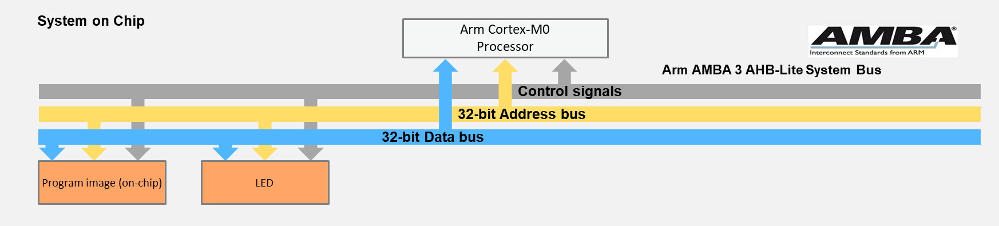
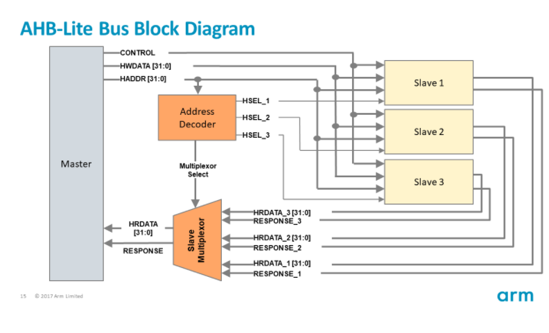
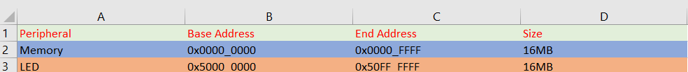

# Simple LED SOC

The hardware components of the SoC include:

1)An Arm Cortex-M0 microprocessor 

2)An AHB-Lite system bus 

3)Two AHB peripherals : 

    1) Program memory (implemented using on-chip memory blocks) 
    
    2)A simple LED peripheral
    
## LED SOC design(Architecture)

## ARM Cortex-m0
The logic of the Arm Cortex-M0 processor is written in Verilog code, and thus can be prototyped (synthesized and implemented) on an FPGA platform. The Cortex-M0 DesignStart has almost the same functionality of an industry-standard Cortex-M0 processor, except that some features are reduced; e.g., the number of interrupts is reduced from the original 32 to 16 interrupts.

Files used from ARM IP : 

     1) cortexm0ds_logic.v
     
     2) CORTEXM0INTEGRATION.v
     
     3) AHBMUX.v
     
     4) AHBDCD.v
     
Link for ARM IP : https://developer.arm.com/products/designstart

## SOC Block Diagram

The above diagram reprasents the general architecture for AHB based designs from ARM. In this SOC we have 2 slave devices one being the code memory and the other is the LED block.

## Memory Map

## JTAG Programming interface
For programming the processor we need an interface. So, in this project I have used the JTAG interface to do that. The verilog code below is the interface I used in this project.

        wire          dbg_tdo;                   // SWV / JTAG TDO
        wire          dbg_tdo_nen;               // SWV / JTAG TDO tristate enable (active low)
        wire          dbg_swdo;                  // SWD I/O 3-state output
        wire          dbg_swdo_en;               // SWD I/O 3-state enable
        wire          dbg_jtag_nsw;              // SWD in JTAG state (HIGH)
        wire          dbg_swo;                   // Serial wire viewer/output
        wire          tdo_enable     = !dbg_tdo_nen | !dbg_jtag_nsw;
        wire          tdo_tms        = dbg_jtag_nsw         ? dbg_tdo    : dbg_swo;
        assign        TMS            = dbg_swdo_en          ? dbg_swdo   : 1'bz;
        assign        TDO            = tdo_enable           ? tdo_tms    : 1'bz;
        
## Peripherals
The two peripherals in this SOC are the Block RAM and the LEDs.

### Block RAM AHB interface
The verilog code below is the AHB Block RAM interface.

    AHB2MEM uAHB2RAM (
          //AHBLITE Signals
          .HSEL(hsel_mem),
          .HCLK(fclk), 
          .HRESETn(hresetn), 
          .HREADY(hreadys),     
          .HADDR(haddrs),
          .HTRANS(htranss), 
          .HWRITE(hwrites),
          .HSIZE(hsizes),
          .HWDATA(hwdatas), 

          .HRDATA(hrdata_mem), 
          .HREADYOUT(hready_mem)
        );
        
The physical memory used to store the instructions is called a program memory. In this basic SoC platform, the program memory is implemented using the on-chip memory blocks, rather than off-chip memories. For example, the block RAM (BRAM) is one type of on-chip memory on Xilinx FPGAs. Normally, in order to load your program into the on-chip memory of an FPGA, the program image needs to be merged into your hardware design during synthesizing. For example, if you need to preload a program file into the hardware, the program file (e.g., “code.hex”) needs to be referred to in your Verilog code, using syntax such as:
        
        initial begin
        $readmemh("code.hex", memory); 
        end

