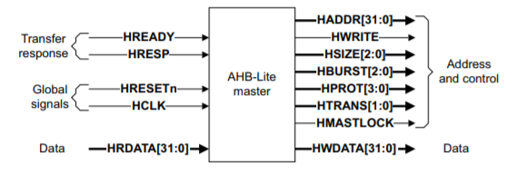
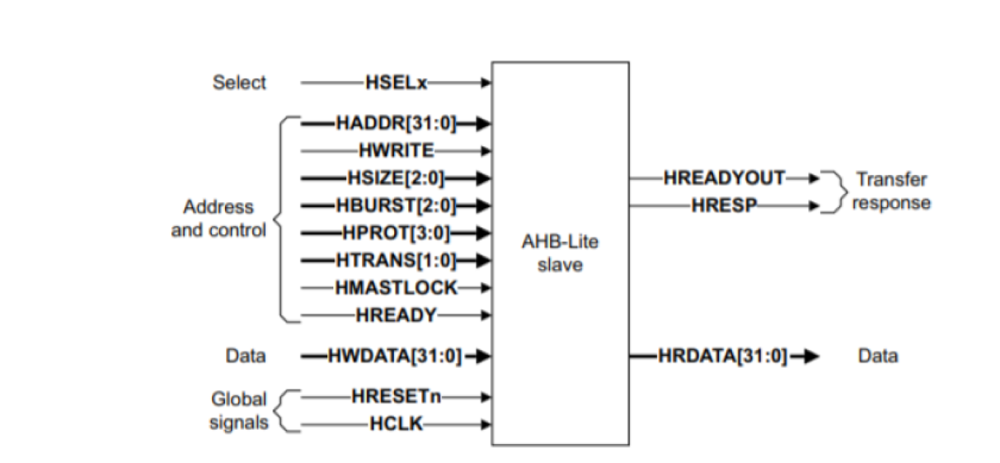
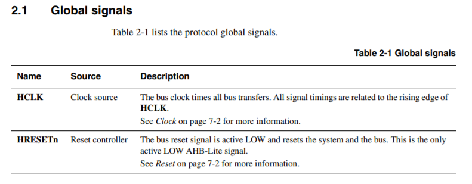
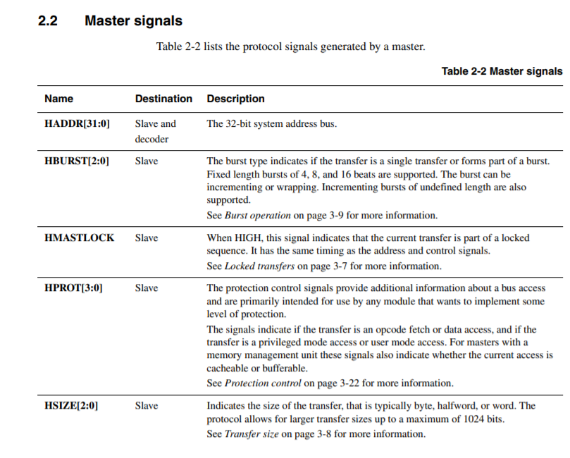
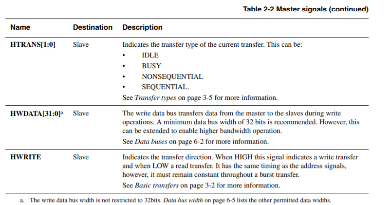
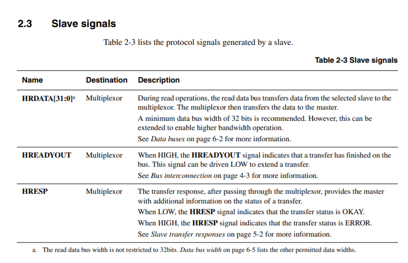
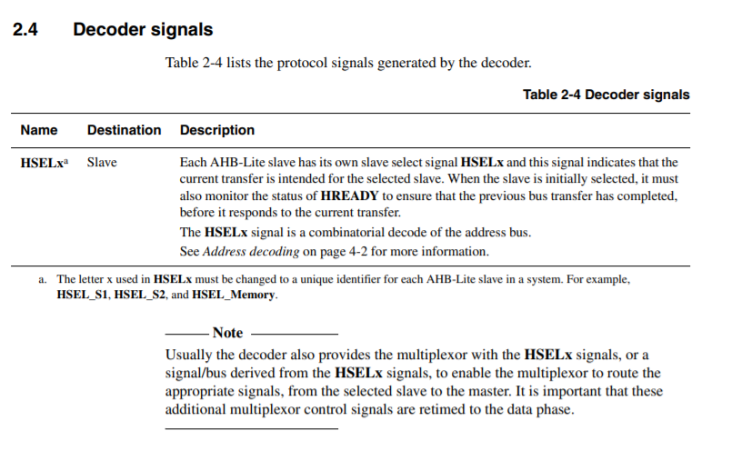
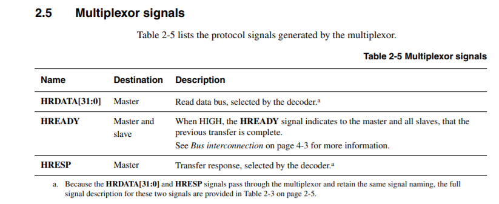

# Simple LED SOC
## The idea
The main idea behind this simple project is to understand the concepts of the AHB-Lite bus , understand the working of the Cortex-M0 processor and learn to add peripherals to the AHB-Lite bus.

The hardware components of the SoC include:

     • An Arm Cortex-M0 microprocessor 
     • An AHB-Lite system bus 
     • Two AHB peripherals : 

         • Program memory (implemented using on-chip memory blocks) 
         • A simple LED peripheral
    
## LED SOC design(Architecture)

## SOC Block Diagram

The above diagram reprasents the general architecture for AHB based designs from ARM. In this SOC we have 2 slave devices one being the code memory and the other is the LED block.

## Description

### ARM Cortex-m0
The logic of the Arm Cortex-M0 processor is written in Verilog code, and thus can be prototyped (synthesized and implemented) on an FPGA platform. The Cortex-M0 DesignStart has almost the same functionality of an industry-standard Cortex-M0 processor, except that some features are reduced; e.g., the number of interrupts is reduced from the original 32 to 16 interrupts.

Files used from ARM IP : 

      • cortexm0ds_logic.v
      • CORTEXM0INTEGRATION.v
      • AHBMUX.v
      • AHBDCD.v
     
Link for ARM IP : https://developer.arm.com/products/designstart

### Memory Map

### JTAG Programming interface
For programming the processor we need an interface. So, in this project I have used the JTAG interface to do that. The verilog code below is the interface I used in this project.

        wire          dbg_tdo;                   // SWV / JTAG TDO
        wire          dbg_tdo_nen;               // SWV / JTAG TDO tristate enable (active low)
        wire          dbg_swdo;                  // SWD I/O 3-state output
        wire          dbg_swdo_en;               // SWD I/O 3-state enable
        wire          dbg_jtag_nsw;              // SWD in JTAG state (HIGH)
        wire          dbg_swo;                   // Serial wire viewer/output
        wire          tdo_enable     = !dbg_tdo_nen | !dbg_jtag_nsw;
        wire          tdo_tms        = dbg_jtag_nsw         ? dbg_tdo    : dbg_swo;
        assign        TMS            = dbg_swdo_en          ? dbg_swdo   : 1'bz;
        assign        TDO            = tdo_enable           ? tdo_tms    : 1'bz;
  
### AHB-Lite Bus
AMBA AHB-Lite addresses the requirements of high-performance synthesizable designs. It is a bus interface that supports a single bus master and provides high-bandwidth operation. 

AHB-Lite implements the features required for high-performance, high clock frequency systems including:
    • burst transfers
    • single-clock edge operation
    • non-tristate implementation
    • wide data bus configurations, 64, 128, 256, 512, and 1024 bits
    
#### AHB-Lite Master
An AHB-Lite master provides address and control information to initiate read and writem operations. The figure below shows a typical AHB-Lite Master. 

#### AHB-Lite Slave
An AHB-Lite slave responds to transfers initiated by masters in the system. The slave uses the HSELx select signal from the decoder to control when it responds to a bus
transfer. The slave signals back to the master:

    • The success
    • Failure
    • Waiting of the data transfer
    

#### Working
The master starts a transfer by driving the address and control signals. These signals provide information about the address, direction, width of the transfer, and indicate if
the transfer forms part of a burst.

Transfers can be:

    • Single
    • Incrementing bursts that do not wrap at address boundaries
    • Wrapping bursts that wrap at particular address boundaries.
    
The write data bus moves data from the master to a slave, and the read data bus moves data from a slave to the master.
Every transfer consists of:

     • Address phase one address and control cycle
     • Data phase one or more cycles for the data.
     
A slave cannot request that the address phase is extended and therefore all slaves must be capable of sampling the address during this time. However, a slave can request that
the master extends the data phase by using HREADY. This signal, when LOW, causes wait states to be inserted into the transfer and enables the slave to have extra time to
provide or sample data. The slave uses HRESP to indicate the success or failure of a transfer.

#### Signals Description [Courtesy of ARM]

    $$$ For more info on AHB-Lite do check this documentation by ARM : https://developer.arm.com/documentation/ihi0033/a/

### Peripherals
The two peripherals in this SOC are the Block RAM and the LEDs.

#### Block RAM AHB interface
The physical memory used to store the instructions is called a program memory. In this basic SoC platform, the program memory is implemented using the on-chip memory blocks, rather than off-chip memories. For example, the block RAM (BRAM) is one type of on-chip memory on Xilinx FPGAs. Normally, in order to load your program into the on-chip memory of an FPGA, the program image needs to be merged into your hardware design during synthesizing. For example, if you need to preload a program file into the hardware, the program file (e.g., “code.hex”) needs to be referred to in your Verilog code, using syntax such as:
        
        initial begin
        $readmemh("code.hex", memory); 
        end
        
The verilog code below instantiates the AHB Block RAM interface.

    AHB2MEM uAHB2RAM (
          //AHBLITE Signals
          .HSEL(hsel_mem),
          .HCLK(fclk), 
          .HRESETn(hresetn), 
          .HREADY(hreadys),     
          .HADDR(haddrs),
          .HTRANS(htranss), 
          .HWRITE(hwrites),
          .HSIZE(hsizes),
          .HWDATA(hwdatas), 

          .HRDATA(hrdata_mem), 
          .HREADYOUT(hready_mem)
        );
        
#### LED AHB interface
The LED peripheral is a simple module used to interface with the 8-bit LEDs. It has an AHB bus interface, which allows the LED to be connected to the system AHB bus, and controlled by the Cortex-M0 processor.

The verilog code below instantiates the AHB LED interface.

    AHB2LED uAHB2LED (
            //AHBLITE Signals
            .HSEL(hsel_led),
            .HCLK(fclk), 
            .HRESETn(hresetn), 
            .HREADY(hreadys),     
            .HADDR(haddrs),
            .HTRANS(htranss), 
            .HWRITE(hwrites),
            .HSIZE(hsizes),
            .HWDATA(hwdatas), 

            .HRDATA(hrdata_led), 
            .HREADYOUT(hready_led),
            //Sideband Signals
            .LED(LED[6:0])
        );

